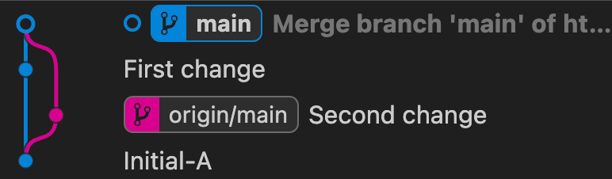
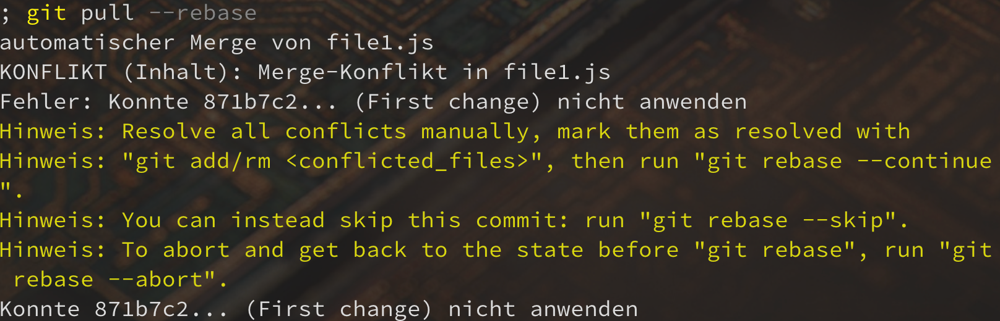
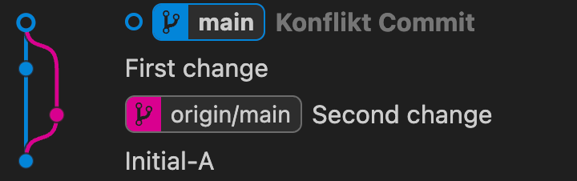

# Pull, Push und Merge

Dieses Übungs-Repository ist anders als die Andern.

Es dient nur zum kopieren der `reset.ps1` Datei.

Diese muss mit `. ./reset.ps1` ausgeführt werden und löscht das Repository (lokal), erstellt ein neues und benötigt dann die URL eines neuen Github Repository (wird nicht automatisch erstellt!).

Anschließend werden je nach Wunsch Änderungen die zu keinen oder einem Konflikt führen erstellt. Im einem zweiten Repository wird automatisch gepushed.

Damit ist die Grundlage für die Übung mit Github geschaffen.

# Szenario 1 : kein Merge Konflikt
(Frage mit `n` beantworten)

Im Original Repo (Ordnerwechsel mit `repo1`) gab es eine Änderung.
Im Zweiten Repo (Ordnerwechsel mit `repos2`) gab es ebenfalls Änderungen, die bereits gepushed wurden.

Damit ist ein `git push` nicht möglich (führt zu einem Fehler).

Nun gibt es 2 Möglichkeiten

## 1. `git pull`

Damit werden die Änderungen vom Remote Repository geholt und ins lokale Repo eingefügt.

Anschliesend kann mit `git push` gepushed werden.

Das Log nach diesem **Merge** Pull sieht dann so aus:

Wir sehen eine Abzweigung durch die Änderung im zweiten Repo.

Wenn dies öfters passiert, macht es das Repo nicht wirklich übersichtlicher. Vor allem, weil der Zweig NICHT durch ein Branch sondern durch ein zuvor durchgeführten Push des gleichen Branches entstanden ist.

## 2. `git pull --rebase`

Wir führen erneut die `. ./reset.ps1` Datei aus. Löschen das Github-Repo und erstellen wierder ein neues.

Diesmal führen wir aber nicht `git pull` aus, sondern `git pull --rebase`

Es wird kein Editor geöffnet, der zum eingeben einer Commit-Message auffordert. Und das Log sieht so aus:

Eine schöne gerade Linie, kein Zweig. Die Änderung des ersten Commits wurden einfach kurz ausgelagert. Dann der "Second change"-Commit vom zweiten Repo gepullt. Anschließend wurde die lokale Änderung einfach nach der vom zweiten Repo eingefügt.

Dies sieht also nun so als, als hätte zuerst der Kollege vom 2. Repo eine Änderung durchgeführt und commited und dann man selbst.

# Szenario 2 : mit Merge Konflikt
(Frage mit `j` beantworten)

In diesem Szenario hat der Kollege an der gleichen Datei eine Änderung vorgenommen.

Daher entsteht beim pull ein Konflikt und man kann nicht einfach ein Rebase durchführen.

## Lösung mit `git pull --rebase`

Also grundsätzlich haben wir gelernt, das `git pull --rebase` die bessere Variante ist.

Also machen wir das.

Es gibt einen Konflikt in der `file1.js`. Diesen können wir wie gewohnt behandeln.

Anschließend müssen wir alle Änderungen adden

`git add .`

Und nun können wir das **rebase** mit `git rebase --continue` fortsetzen.

Es öffnet sich nun ein Editor, da wir einen Merge-Commit brauchen.

Aber das Log ist trotzdem eine schöne Linie:

Anschließend pushen wir unsere Änderung mit `git push` und wechseln testhalber in das 2. Repo mit `repo2`

Dort führen wir ebenfalls ein `git pull --rebase` aus.

Wir sehen, das die Änderung des Konflikt-Commits wunderbar ankommen und das Log eine schöne Linie ist.

## Lösung mit `git pull`

Wir führen erneut `. /reset.ps1` aus (es muss nicht ins 1. Repo wechselt werden). Github Repo löschen und neu anlegen. URL einfügen.

Nun machen wir ein `git pull`. Es gibt wieder ein Merge Konflikt den wir lösen.

Nun müssen wie die Änderung wieder adden `git add .`.

Aber anstellle von *git rebase --continue* müssen wir diesmal ein `git commit -m "Konflikt Commit"` erstellen.

Durch den Merge-Pull entsteht also einmal ein Zweig da zwei Commits sich auf `Initial-A` beziehen.
Dann sind alle Änderungen im Repo und werden vereint in ein Konflikt Commit.

Dies bläht das Log noch mehr auf.

Daher immer `git pull --rebase` verwenden.
